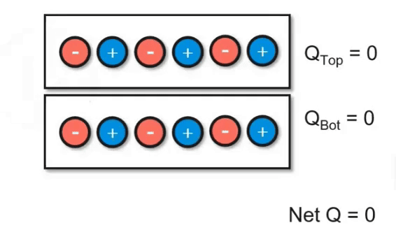

# 8.2 - Charging Objects

## Charging Objects by Friction

Using friction, you can "brush" electrons onto another object. In the video below, you can see how electrons are being transferred between the two objects. However, keep in mind that the **net charge of the system did not change.** This follows the principles of the conservation of energy. Even though we *transferred* charge, we didn't add or remove it.

## Charging Objects by Conduction

Another way to charge objects is by transferring charge from one item to another to reach equilibrium.

:::note

In reality, when two electrical objects undergo charging by conduction, they are actually trying to reach the same electrical potential. We won't go over electrical potential right now though, so we will simply say they are trying to reach equilibrium.

This difference is important because one must remember that objects are **not always trying to equalize their charges.** For example, a large object and small object with different charges aren't going to automatically equalize; they will still have different charges. For our demonstration, we can assume both objects are the same size and same conducting material.

:::

We start with two metal objects. One has no net charge and one has a positive charge of 2.

We connect both objects with a conductive wire.

In order to achieve equilibrium, an electron will travel to the object on the right.

After the process, both objects have a charge of 1.

## Charging Objects by Induction

Induction is the process of charging a conductor, such as a metal, without touching it. Below is an example of how this works:

A conductive metal object, which we will call Object M, starts with a neutral charge (equal electrons and protons).

Object M is brought near another object. However, the second object, which we will call Object C, is charged. Let's say that Object C has a negative charge.

When we bring Object C near Object M, any electrons in M that are close to C will be repelled due to C's negative charge. Remember: since Object M is made up of conductive metal, the electrons can move around freely. Therefore, the electrons will move to the other side of M.

Now, the part of Object M that was closest to Object C will have an overall positive charge since those electrons moved away. However, Object M still won't be charged! The reason is because the electrons haven't left M. They are still there but have just moved away from where Object C is. When we remove Object C, the electrons won't be repelled anymore and the overall charge of Object M won't be different. To make Object M charged, we need to **ground** it.

The wire connected to the three bars is the symbol for ground.

After we ground Object M, some of the repelled electrons that have moved to the other side will end up escaping through the wire and entering Earth.

When you cut off the ground connection, Object M will have more protons than electrons because those repelled electrons have left. Therefore, the overall charge will be *positive*.

We can remove object C. Thus, we have used induction to positively charge Object M!

## Useful Resources

**8.2**

* [Charging via conduction](https://www.physicsclassroom.com/class/estatics/Lesson-2/Charging-by-Conduction)
* [Charging via friction (also called triboelectric charging)](https://www.physicsclassroom.com/class/estatics/Lesson-2/Charging-by-Friction)
* [Charging by induction](https://www.physicsclassroom.com/class/estatics/Lesson-2/Charging-by-Induction)
* [Charging by induction video](https://www.youtube.com/watch?v=ZbBHnod_Mew)