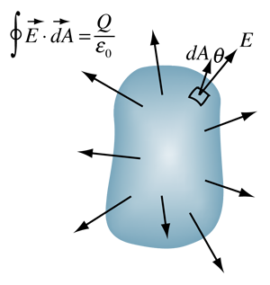

# 8.6 - Electric Flux

## 8.6.1 - Flux

Earlier we learned about electric fields and their interactions with objects. However, we have not yet covered the idea of an electric field passing through a surface. By definition, the meaning of flux is *flow*; a measurement of flux is a measurement of flow.

Before tackling electric flux, let's assume we are working with air. Let's assume that air is traveling through a vent of area $A = 4 \, \text{m}^2$ at a velocity of $v = 10 \, \text{m/s}$. How can we calculate the flux in this scenario? Well, flux is nothing but flow so in reality we are trying to calculate the rate for the amount of air which is flowing out of this vent. So we are trying to calculate the amount of air which flows out of this vent every second.

From this we realize that every second, the air which flows out stretches 10 meters. The area of the vent is 4 meters squared though. So to give our answer for the electric flux, we are able to just multiply the velocity by the area to get an electric flux of 40 cubic meters per second. From this, we can get the equation $\Phi_A = VA_{\perp}$ which explains that the flux of the air is equal to the velocity it flows at times the area of the outlet. It is also important to note that A is the area which is perpendicular to the electric field vector.

Now in order to think of this in the context of electric flux, we must replace velocity with the electric field vector. Electric flux is a measure of the flow of an electric field through a surface. Therefore, the formula for electric flux becomes $\Phi_E = EA_{\perp}$. If the electric field vector enters a surface from a direction which is not perpendicular though, the component of the area which is perpendicular to the electric field vector is used instead. So the equation could also be written as $\Phi_E = EAcos(\theta)$ where $\theta$ is the angle between the electric field line and an imaginary line which is perpendicular to the area.

:::tip[Key Equation]

$\Phi_E = EA_{\perp} = EAcos(\theta)$

**Note:** $\theta$ is the angle between the electric field line and an imaginary line which is perpendicular to the area

:::

:::info[Sample Question]

A large flat metal sheet lies horizontally on the ground under a uniformly distributed electric field. A circular loop of radius $r = 0.4 , \text{m}$ is held perpendicular to the field lines, which point vertically upward with a constant magnitude of $E = 250 , \text{N/C}$. What is the total electric flux $\Phi_E$ through the loop?

$\Phi_E = EA\cos\theta$
Since the electric field is perpendicular to the loop, $\theta = 0^\circ$, and $\cos\theta = 1$

$A = \pi r^2 = \pi (0.4)^2 = 0.16\pi , \text{m}^2$

$\Phi_E = (250)(0.16\pi) = 40\pi , \text{N} \cdot \text{m}^2/\text{C}$

$\Phi_E \approx 125.7 , \text{N} \cdot \text{m}^2/\text{C}$

:::

What if we are now working with complex surfaces? Like maybe a closed surface? The area of that will not only be too complex to find, but the electric flux will differ at each part of the figure due to the differing orientations of the perpendicular surface and the electric field vector.

Well, in physics we usually see that whenever there is a problem concerning multiple infinitely small pieces, especially in an equation, the answer almost always requires calculus. Imagine if we separated this complex figure into multiple squares. In a closed surface such as the surface of the sphere we are analyzing the flux of the electric field vector entering and exiting. So if the field lines go outwards, the electric flux is positive. If the field lines go inwards, the electric flux is negative. A flux of 0 means that the electric field vector is parallel to the surface itself.

:::tip[Key Equation]

$\Phi_E = \oint \mathbf{E} \cdot d\mathbf{A}$

**Note:** The integral with a ring in it represents the integral of a closed path or a surface. Evaluating it may be a bit complex, but that is where Gauss's Law comes in. Gauss's Law will let us find the quantity above easily.

:::

## 8.6.2 - Gauss's Law

The way that Gauss's Law was first derived was by looking at electric flux through a sphere. Consider a point charge $\mathbf{q}$ such that $\mathbf{q}$ is placed in the center of a sphere of radius $\mathbf{r}$. The electric field generated in this setup can be represented as $\mathbf{E} = \frac{k_e q}{r^2}$. The electric field generated by the charge radiates outward, so every chunk of area $\mathbf{dA}$ on the sphere has an electric field vector which is perpendicular to it. Using this information, we can derive the net electric flux for the sphere as shown below.

$E = \frac{k_e q}{r^2}$

Since the electric field $\mathbf{E}$ is radial and constant over the surface, and  
$\mathbf{E} \parallel d\mathbf{A}$ at every point, the differential flux is:

$d\Phi_E = \mathbf{E} \cdot d\mathbf{A} = E \, dA$

The total electric flux through the surface is:

$\Phi_E = \oint \mathbf{E} \cdot d\mathbf{A} = E \oint dA = E \cdot A$

For a sphere, the total area is $A = 4\pi r^2$, so:

$\Phi_E = \left( \frac{k_e q}{r^2} \right)(4\pi r^2) = 4\pi k_e q$

Using the identity $k_e = \frac{1}{4\pi \varepsilon_0}$, we get:

$\Phi_E = \frac{q}{\varepsilon_0}$

However, this derived equation for the net flux can actually be used for any closed surface due to the nature of electric fields and vector calculus. Charges outside the closed surface have electric field lines which enter and leave therefore their effect on the net flux is 0. **Gauss's Law works for any closed surface no matter its shape**

:::tip[Key Equation]

$\Phi_E = \oint \mathbf{E} \cdot d\mathbf{A} = \frac{q}{\varepsilon_0}$

:::

:::note[Suggested Content]

Here is a video describing the idea of electric flux and Gauss's law with more vivid models.

<iframe width="560" height="315" src="https://www.youtube.com/embed/yOv4xxopQFQ?si=oMqZTs2xB-xEqy0q" title="YouTube video player" frameborder="0" allow="accelerometer; autoplay; clipboard-write; encrypted-media; gyroscope; picture-in-picture; web-share" referrerpolicy="strict-origin-when-cross-origin" allowfullscreen></iframe>

:::

## Useful Resources

**8.6.1**

* [Intro to flux](https://openstax.org/books/university-physics-volume-2/pages/6-1-electric-flux)
* [Flux and Gauss's Law](https://phys.libretexts.org/Bookshelves/University_Physics/Physics_(Boundless)/17%3A_Electric_Charge_and_Field/17.5%3A_Electric_Flux_and_Gausss_Law)
* [Electric flux article](https://byjus.com/physics/electric-flux/)
* [Video about electric flux and how to calculate it](https://www.youtube.com/watch?v=9MN0eTC-vzQ)

**8.6.2**

* [Gauss's Law](http://hyperphysics.phy-astr.gsu.edu/hbase/electric/gaulaw.html)
* [Explaining Gauss's Law](https://phys.libretexts.org/Bookshelves/University_Physics/University_Physics_(OpenStax)/University_Physics_II_-_Thermodynamics_Electricity_and_Magnetism_(OpenStax)/06%3A_Gauss%27s_Law/6.03%3A_Explaining_Gausss_Law)
* [Article about Gauss's Law](https://web.chem.ox.ac.uk/teaching/Physics%20for%20CHemists/Electricity/Gauss.html)
* [Video about flux, Gauss's Law and electric fields](https://www.youtube.com/watch?v=q1eor6oIuUo)
* [Gauss's Law made easy](https://www.youtube.com/watch?v=l2F4xuzRbFY)

## Equations and Constants

**Equations**

* $\Phi_E = EA_{\perp} = EAcos(\theta)$
  * $A_{\perp}$ = the area perpendicular to the electric field vectors
  * $E$ = the electric field
  * $\theta$ = the angle between the electric field line and an imaginary line that is perpendicular to the area
* $\Phi_E = \oint \mathbf{E} \cdot d\mathbf{A}$
  * **Note:** you most likely won't have to worry about this equation. Most problems don't need this difficult calculus, so you can often use the easier formula listed below.
  * $\oint \mathbf{E}$ = the surface integral of where the field is being produced/emitted
* $\Phi_E = \frac{q}{\varepsilon_0}$
  * $q$ = the electric charge
  * $\varepsilon_0$ = permittivity of free space

  

* For ALL equations listed above:
  * $\Phi_E$ = the electric flux
