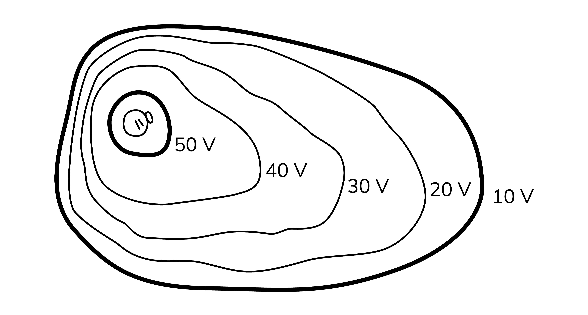
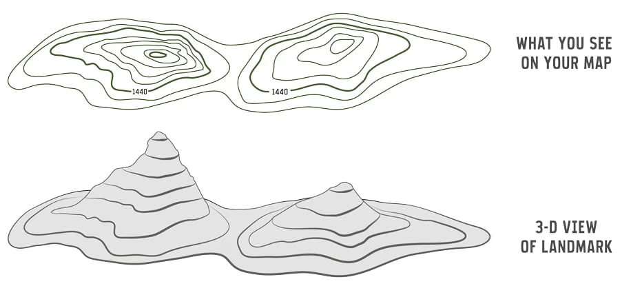

# 9.1 - Electric Potential

Because electrostatic force is conservative, we can use *electric potential*. This is incredibly useful for working with electrical circuits and devices (along with trying to avoid using forces as much as possible 😉).

## 9.1.1 - Electric Potential and Gravitational Potential

Just like earlier units, let’s start by comparing concepts from electricity to concepts from mechanics. In mechanics, we know that there is gravitational potential energy $U_{G}$. In electricity, it is denoted as $U_{E}$.

The similarities between electrical and gravitational potential are as follows:

1. You need two objects in a system. For example, you can’t have $U_{G}$ unless there are two masses. One mass **cannot** have $U_{G}$. Similarly, you need two charged objects to have $U_{E}$
2. Both $U_{G}$ and $U_{E}$ are proportional to $\frac{1}{r}$.

In fact, even the formulas are the same! Perhaps Coulomb was copying Newton’s homework…

$\large U_{E} = \frac{k \cdot q_{1}q_{2}}{r} \hspace{35pt} U_{G} = \frac{G \cdot m_{1}m_{2}}{r}$

## 9.1.2 - Electric Potential in Depth

:::tip[Key Equation]

$\large U_{E} = \frac{k \cdot q_{1}q_{2}}{r}$

* $U_{E}$ is the electrical potential energy
  * **Important note:** $U_{E}$ is a scalar quantity and can be *negative or positive*.  We will go over this later.
* $k$ is the Coulomb constant
* $q_{1}$ and $q_{2}$ are the two charges

:::

:::tip[Key Equation]

$\large U_{E} = qV$

$\large V = \frac{U_{E}}{q} = \frac{kq}{r}$

**${V}$ is the symbol for electric potential, but $U_{E}$ is electric potential *energy*.**

:::

If there’s more than two charged objects, you’ll need to calculate $U_{E}$ for every pair of objects. **Don’t forget the signs of the charges.** Negative charges will have negative value.

:::info[Sample Question]

What is the total electric potential energy for the system? Derive an expression.

**Solution:**

We need to get the electric potential for every pair of objects. The pairs are: $q_{1}$ and $q_{2}$, $q_{1}$ and $q_{3}$, $q_{2}$ and $q_{3}$.

We also need to keep in mind that $q_{1}$ and $q_{2}$ are *positive,* while $q_{3}$ is negative. Our equation is as follows:

$\large U_{E} = k\frac{q_{1}q_{2}}{r_{12}} - k\frac{q_{1}q_{3}}{r_{13}} - k\frac{q_{2}q_{3}}{r_{23}}$

* $r_{12}$ is the distance between charges $q_{1}$ and $q_{2}$
* $r_{13}$ is the distance between charges $q_{1}$ and $q_{3}$
* $r_{23}$ is the distance between charges $q_{2}$ and $q_{3}$
* Because $q_{3}$ is negative, this means that $k\frac{q_{1}q_{3}}{r_{13}}$ and $k\frac{q_{2}q_{3}}{r_{23}}$ are negative

:::

## 9.1.3 - Negative and Positive Electric Potential

When the charges are of the opposite sign, you will have negative electric potential energy. However, when the charges are of the same sign, you will have positive electric potential energy.

## 9.1.4 - The Link Between Electric Field and Potential

:::tip[Key Equation]

$\large E_{x} = \frac{dV}{dx}$

$\large \Delta V = -\int_{}^{}\overrightarrow{E}\cdot d\overrightarrow{r}$

* $\Delta V$ is electric potential

$\large \Delta V = V_{final} - V_{initial}$

* Electric fields move from high to low potential, so $\Delta V$ is negative

:::

Similar to kinematics, we can use calculus to get expressions for electric potential $V$ from equations defining electric field $E$.

$\large E_{x} = 6x^{2}+7x$

$\large \Delta V = -\int_{}^{}\overrightarrow{E}\cdot d\overrightarrow{r}$

We are integrating with respect to $x$, so instead of $dr$, we will use $dx$.

$\large \Delta V = -\int_{}^{}\overrightarrow{E}\cdot d\overrightarrow{x} = -\int_{}^{} (6x^{2}+7x)dx = - \left( \frac{6x^{3}}{3}+\frac{7x^{2}}{2} \right) + C = -3x^{3} - \frac{7}{2}x^{2} +C$

In this context, $C$ is $V_{0}$, or the initial electric potential.

## 9.1.5 - Equipotential Lines

An **equipotential line** is a line that tells us where potential is equal. However, this does *NOT* mean that the potential is 0. You can think of these lines like a topographic map.

Like the topographic map, when lines are close together, we know that the potential is changing quickly in a small space. It’s the electrical equivalent of a steep hill on a topographic map. We can conclude that the electric field is large from this.

## Useful Resources

**9.1.1**

* [Field potential explanation](https://isaacscience.org/concepts/cp_potential)
* [Video comparing electrical and gravitational potential](https://www.youtube.com/watch?v=h2cn3AiiBO4)

**9.1.2**

* [Khan academy article explaining electric potential](www.khanacademy.org/test-prep/mcat/physical-processes/electrostatics-1/a/electric-potential)
* [Electric potential article (a little complicated though)](https://phys.libretexts.org/Bookshelves/University_Physics/University_Physics_(OpenStax)/University_Physics_II_-_Thermodynamics_Electricity_and_Magnetism_(OpenStax)/07%3A_Electric_Potential/7.02%3A_Electric_Potential_Energy)

**9.1.3**

* [Negative electric potential video](https://www.youtube.com/watch?v=Dcn62trW8X8&t=121)

**9.1.4**

* [The conection between electric field and potential (video)](https://www.youtube.com/watch?v=RNofANV680Q&t=210)
* [The Organic Chemistry Tutor video about electric field and potential](https://www.youtube.com/watch?v=LzKMQByFSLc&t=869)

**9.1.5**

* [Video about equipotential lines](https://www.youtube.com/watch?v=1XI4D4SgHTw&t=6)
* [Another video about equipotential lines](https://www.youtube.com/watch?v=G9CpMXuWw6g&t=748)
* [Article about equipotential lines](http://hyperphysics.phy-astr.gsu.edu/hbase/electric/equipot.html)

## Equations and Constants

**Equations**

* $\large U_{E} = \frac{k \cdot q_{1}q_{2}}{r}$
  * $U_{E}$ = electrical potential energy
  * $k$ = Coulomb constant
  * $q_{1}$ and $q_{2}$ = the two charges

* $\large U_{E} = qV$
  * $V = \frac{U_{E}}{q} = \frac{kq}{r}$

* $\large E_{x} = \frac{dV}{dx}$

* $\large \Delta V = -\int_{}^{}\overrightarrow{E}\cdot d\overrightarrow{r}$
  * $\Delta V$ = electric potential
  * $\large \Delta V = V_{final} - V_{initial}$